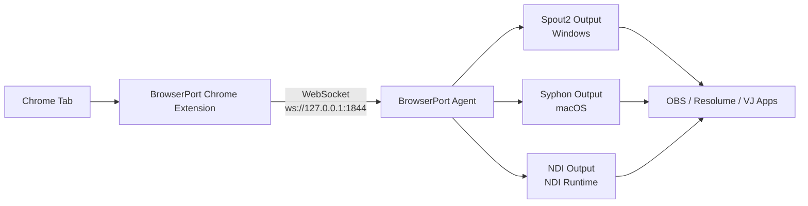

BrowserPort is a Chrome extension + desktop agent relay for sending browser video/audio to local creative/video apps.

[日本語版 README](./README_JP.md) | [Contributing](./contributing.md)

## Overview

- Chrome extension captures media from Chrome tabs.
- Desktop `agent` receives streams over local WebSocket (`ws://127.0.0.1:1844` by default).
- Agent outputs to:
  - `Spout2` on Windows
  - `Syphon` on macOS
  - `NDI` when NDI Runtime is available on the host
- Output can be consumed by OBS, VDMX6, and other VJ/video tools.

## Flow

BrowserPort captures video in Chrome, relays it to a local native process, and republishes it through low-latency media interop outputs (Spout2/Syphon/NDI).

## Install

Download the latest artifacts from GitHub Releases:

- https://github.com/kamijin-fanta/browser-port/releases

Use matching versions for the Chrome Extension and Agent. Do not mix different version numbers.

| Component | Example file |
| --- | --- |
| Agent (Windows MSI) | `browser-port-<version>-x86_64-pc-windows-msvc-unsigned.msi` |
| Agent (Windows standalone) | `browser-port-<version>-x86_64-pc-windows-msvc.exe` |
| Agent (macOS) | `browser-port-<version>-aarch64-apple-darwin-unsigned.dmg` |
| Agent (Linux) | `browser-port-<version>-x86_64-unknown-linux-gnu-linux-installer.tar.gz` |
| Chrome Extension | `browser-port-chrome-extension-<version>.zip` |

## Quick Start

1. Install or launch the Agent from the release package.
2. Open `chrome://extensions`, enable Developer mode, then load the unzipped extension package.
3. Start streaming from the extension.
4. Select BrowserPort output in your target app (Spout2/Syphon/NDI).

## Notes

- On macOS, use Syphon instead of Spout.
- On hosts without NDI Runtime, NDI output remains unavailable while BrowserPort itself still runs.
