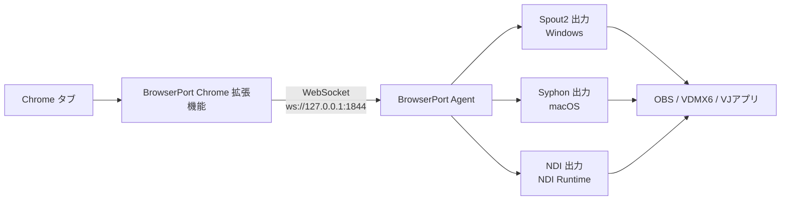

BrowserPort は、Chrome 拡張機能とデスクトップ Agent を組み合わせて、ブラウザ映像/音声をローカルの映像制作アプリへ中継するためのツールです。

[English README](./README.md) | [Contributing](./contributing.md)

## 概要

- Chrome 拡張機能で Chrome タブのメディアをキャプチャします。
- デスクトップ `agent` がローカル WebSocket（既定: `ws://127.0.0.1:1844`）で受信します。
- Agent は以下へ出力します。
  - Windows: `Spout2`
  - macOS: `Syphon`
  - `NDI`（ホストに NDI Runtime がある場合）
- 出力先として OBS、VDMX6、その他 VJ/映像アプリを利用できます。

## フロー

BrowserPort は、Chrome の映像を拡張機能で取り込み、ローカル Agent で受信し、Spout2/Syphon/NDI として再送出します。

## インストール

GitHub Releases から最新の配布物を取得してください。

- https://github.com/kamijin-fanta/browser-port/releases

Chrome Extension と Agent は必ず同じバージョンを使用してください。異なるバージョンは混在させないでください。

| コンポーネント | ファイル名例 |
| --- | --- |
| Agent（Windows MSI） | `browser-port-<version>-x86_64-pc-windows-msvc-unsigned.msi` |
| Agent（Windows 単体 EXE） | `browser-port-<version>-x86_64-pc-windows-msvc.exe` |
| Agent（macOS） | `browser-port-<version>-aarch64-apple-darwin-unsigned.dmg` |
| Agent（Linux） | `browser-port-<version>-x86_64-unknown-linux-gnu-linux-installer.tar.gz` |
| Chrome Extension | `browser-port-chrome-extension-<version>.zip` |

## クイックスタート

1. Release から取得した Agent をインストール、または起動します。
2. `chrome://extensions` を開き、デベロッパーモードを有効化して、解凍した拡張機能を読み込みます。
3. 拡張機能から配信を開始します。
4. 利用先アプリで BrowserPort の出力（Spout2/Syphon/NDI）を選択します。

## 補足

- macOS では Spout の代わりに Syphon を使用してください。
- NDI Runtime がない環境では NDI 出力のみ無効になり、BrowserPort 本体は起動可能です。
